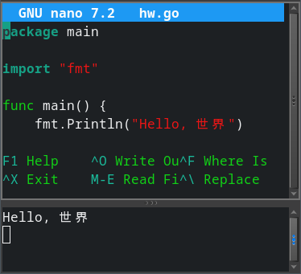

# REPL Ace

A REPL for all languages and compilers. One command is all you need.

    repl.sh [source]
    or
    repl.sh [compiler] -run [source] [optional args]

## Dependencies

Install `fswatch`, available from distro package manager.

Get optional compiler, preprocessor for your favorite language.

    TinyCC | https://repo.or.cz/tinycc.git/
    Crap   | https://themanyone.github.io/crap/
    Go     | https://go.dev/
    Zig    | https://ziglang.org/
    Hare   | https://sr.ht/~sircmpwn/hare/sources

## Installation

Copy scripts to somewhere in $PATH.
    install -D r* /usr/local/bin

## Make Sources Executable
    chmod +x hello.c

Put this header at the top of the source code.
    //usr/local/bin/tcc $0 -run -- foo bar baz; exit $?

This tricks the shell into running the compiler.

The -- foo bar baz arguments are optional, for testing.
Your script can access them in the argv[] argument list.

Here's one for go compiler.
    //path/to/go run "$0" -- foo bar && exit $?

Another example for zig.
    //path/to/repl.sh zig run hello.zig fizz buzz && exit $?

It's basically a bash script, so you can run other commands.

## Usage

Now you can run scripted source code from the terminal.

    * Try it.
        `./hello.c`
    * Launch repl.sh command or alias.
        `repl.sh ./hello.c`
    * Edit the [source] with your favorite editor.
        `nano hello.c`
    * Script will re-run whenever it is saved in the editor.

You could also run python scripts whenever they are updated.
    `repl.sh hello.py`

Use it for any kind of script, configuration, or AI agent.

## Advanced Usage

Sometimes it's a challenge making sources into executable scripts. We can also compile and run them from the command line, using the editor's F5 `run` command, or by using an alias.

Make aliases for your favorite REPLs.
    alias repl_c='repl.sh tcc -run hello.c hello world'
    alias repl_go='repl.sh go run hello.go foo bar baz'
    alias repl_zig='repl.sh zig run hello.zig fizz buzz'

Put aliases in `~/.bashrc` for later use.

## Extra arguments

Supply extra arguments to access them in source code.
    `repl.sh tcc -run hello.c hello world`
    `printf("%s %s", argv[1], argv[2]); //outputs "hello world"`

Print arguments in golang.
    `repl.sh go run hello.go foo bar baz`

    ```go
    package main; import ("fmt"; "os")
    func main() {
        fmt.Printf("Args 1: %s\n", os.Args[1]) // prints foo
    }
    ```

## Runner

Use `runner` if your compiler has no `-run` option.
Code `runner` can be used in script headers or commands.
The `-o` is optional if `repl.sh` can find the executable.

In script headers.
    //path/to/runner my_compiler "$0" -- my args && exit 0
    //path/to/runner go build "$0" -- foo bar && exit 0

From command line
    repl.sh zig run hello.zig fizz buzz
    repl.sh runner gcc $CFLAGS $LIBS -o test test.c -- my args
    repl.sh runner hare build hello.ha -- my args

## Sharing

    This program is free software; you can redistribute it and/or modify
    it under the terms of the GNU General Public License as published by
    the Free Software Foundation; either version 2 of the License, or
    (at your option) any later version.

    This program is distributed in the hope that it will be useful,
    but WITHOUT ANY WARRANTY; without even the implied warranty of
    MERCHANTABILITY or FITNESS FOR A PARTICULAR PURPOSE.  See the
    GNU General Public License for more details.

    You should have received a copy of the GNU General Public License along
    with this program; if not, write to the Free Software Foundation, Inc.,
    51 Franklin Street, Fifth Floor, Boston, MA 02110-1301 USA.

## Updates

    Get updates from https://github.com/themanyone/REPLace.git

## Other REPLs

    Itcc: repl for c-like languages https://github.com/themanyone/itcc
    various languages in the browser http://repl.it
    csharp: included with monodevelop http://www.csharphelp.com/
    psysh: comes with php for php code http://php.net
    evcxr: another Rust REPL https://github.com/evcxr/evcxr
    ipython: interactive python https://github.com/ipython/ipython
    rep.lua: a lua REPL https://github.com/hoelzro/lua-repl
    re.pl: perl command line https://github.com/daurnimator/rep
    d8-314: from V8, JavaScript https://developers.google.com/v8/
    csi: from chicken, a scheme REPL http://call-cc.org/
    RStudio: interactive R coding https://rstudio.com/
    Ruby IRB: REPL tool for Ruby https://ruby-doc.org/stdlib-2.7.2/libdoc/irb/rdoc/IRB.html
    numerous bash-like shells and interpreters

## Author's links

    - GitHub https://github.com/themanyone
    - YouTube https://www.youtube.com/themanyone
    - Mastodon https://mastodon.social/@themanyone
    - Linkedin https://www.linkedin.com/in/henry-kroll-iii-93860426/
    - [TheNerdShow.com](http://thenerdshow.com/)
